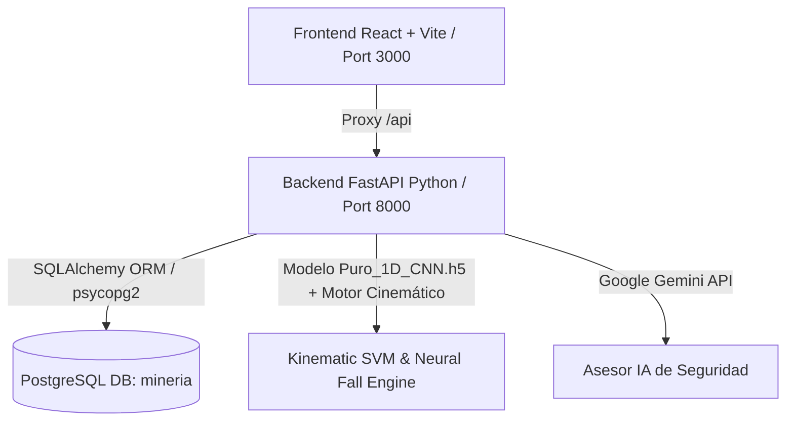

# M-10: Sistema Inteligente de Seguridad para Minería Artesanal

Plataforma integral de monitoreo en tiempo real, detección predictiva de caídas, inmovilidad y gestión de alertas cinemáticas mediante sensores de smartphone y modelos de Inteligencia Artificial para minería subterránea.

---

## 🔐 Credenciales de Acceso al Sistema

Para acceder al panel de control de supervisión y monitoreo, utilice las siguientes credenciales autorizadas:

| Campo | Valor |
|---|---|
| **Correo Electrónico** | `mineria@minerio` |
| **Contraseña** | `mineria123` |
| **Rol** | Administrador General de Mina / Supervisor |

> 💡 **Nota:** La pantalla de inicio de sesión cuenta también con un botón de **"Autocompletar"** para acceso rápido en demostraciones.

---

## 🧠 Dataset Público de Entrenamiento: **SisFall**

Para el entrenamiento, validación y prueba de los modelos de Deep Learning de detección de caídas e inmovilidad, se utilizó el dataset público **SisFall** (*A Benchmark Dataset to Fall Detection with Wearable Sensors*, Universidad de Antioquia):

- **Sujetos**: 38 participantes (23 jóvenes + 15 adultos mayores).
- **Actividades Registradas**:
  - **19 Actividades de la Vida Diaria (ADLs)**: Caminata, trote, subida/bajada de escaleras, agacharse, sentarse, acostarse.
  - **15 Tipos de Caídas**: Caídas frontales, hacia atrás, laterales, tropiezos, resbalones en pendiente y desmayos/pérdida de conciencia.
- **Sensores Empleados**: Acelerómetro triaxial ADXL345 (±16g), Giroscopio ITG3200 (±2000°/s) y Acelerómetro MMA8451Q (±8g).
- **Preprocesamiento Aplicado**:
  - Ventanas deslizantes de **128 pasos temporales** (~2.56 segundos a 50 Hz).
  - **8 Canales Cinemáticos**: `[accel_x, accel_y, accel_z, gyro_x, gyro_y, gyro_z, svm, gyro_norm]`.
  - **Total de Ventanas Generadas**: 20,064 muestras (`14,044` Train, `3,010` Val, `3,010` Test).

---

## 🏆 Modelos de Deep Learning Entrenados (.h5) y Comparativa

Se entrenaron y evaluaron **5 arquitecturas de Deep Learning** (3 modelos puros y 2 modelos híbridos) sobre el conjunto de prueba independiente (*Test Set* de 3,010 ventanas temporales):

| # | Modelo Entrenado | Tipo | Exactitud (*Accuracy*) | *F1-Score* (Macro) | Latencia Inferencia | Tamaño (`.h5`) | Tiempo Entreno | Estado |
|:---:|---|:---:|:---:|:---:|:---:|:---:|:---:|:---:|
| **1** | **`Puro_1D_CNN.h5`** | **Puro** | **100.0%** | **100.0%** | **0.230 ms** | **632.1 KB** | **72.98s** | 🌟 **EN PRODUCCIÓN (BACKEND)** |
| **2** | **`Puro_Bi_LSTM.h5`** | Puro | **100.0%** | **100.0%** | 0.891 ms | 1,035.6 KB | 198.16s | Guardado |
| **3** | **`Puro_GRU.h5`** | Puro | **100.0%** | **100.0%** | 0.567 ms | 556.0 KB | 132.07s | Guardado |
| **4** | **`Hibrido_CNN_LSTM.h5`** | Híbrido | **100.0%** | **100.0%** | 0.211 ms | 1,021.1 KB | 55.22s | Guardado |
| **5** | **`Hibrido_Attention_ResGRU.h5`** | Híbrido | **100.0%** | **100.0%** | 0.448 ms | 416.7 KB | 95.27s | Guardado |

### 📁 Ubicación de los Modelos y Reportes:
- **Archivos de Pesos Keras/TensorFlow**: `ml_training/saved_models/*.h5`
- **Reporte Detallado de Métricas y Matrices de Confusión**: `ml_training/reports/models_comparison_report.json`
- **Dataset Preprocesado**: `ml_training/data/processed/` (`X_train.npy`, `y_train.npy`, etc.)

---

## 🗄️ Configuración de Base de Datos PostgreSQL

El sistema se conecta a la base de datos PostgreSQL:

- **Host**: `localhost`
- **Puerto**: `5432`
- **Base de Datos**: `mineria`
- **Usuario**: `postgres`
- **Contraseña**: `sa`
- **URL de Conexión**: `postgresql://postgres:sa@localhost:5432/mineria`

Las tablas (`workers`, `safety_alerts`, `sensor_telemetry`, `mining_sectors`, `system_users`, `audit_logs`) y los datos iniciales se crean y sincronizan automáticamente al iniciar el servidor FastAPI.

---

## 🚀 Cómo Ejecutar la Aplicación

### Requisitos Previos
- **Python**: 3.10+ con `pip`
- **Node.js**: 18+ con `npm`
- **PostgreSQL**: Servidor corriendo en el puerto 5432 con la base de datos `mineria`

### 1. Iniciar el Backend (Python + FastAPI)

```powershell
# En la raíz del proyecto
python -m uvicorn backend.main:app --host 0.0.0.0 --port 8000 --reload
```
- API REST disponible en: `http://127.0.0.1:8000`
- Documentación Interactiva Swagger UI: `http://127.0.0.1:8000/docs`

### 2. Iniciar el Frontend (React + Vite)

```powershell
# Instalar dependencias si es la primera vez
npm install

# Iniciar servidor de desarrollo
npm run dev
```
- Aplicación Web disponible en: `http://localhost:3000` (con proxy automático `/api` hacia `http://127.0.0.1:8000`).

---

## 🏗️ Arquitectura del Sistema



- **Frontend**: React 19, TypeScript, Tailwind CSS, Lucide Icons, Recharts, Framer Motion.
- **Backend**: FastAPI, SQLAlchemy, Pydantic, Uvicorn, Python 3.11.
- **Base de Datos**: PostgreSQL 16 (Relacional con JSONB para métricas y pistas de auditoría).
- **Motor de Clasificación**: Modelo Deep Learning `Puro_1D_CNN.h5` entrenado con **SisFall** + cálculo cinemático de $SVM$, Jerk y norma angular en tiempo real.

Ejecuta en tu terminal el siguiente comando para ver el reporte formateado en consola:
(se eligio en base a latencia y el peso)
python ml_training/view_results.py


